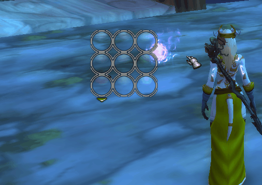
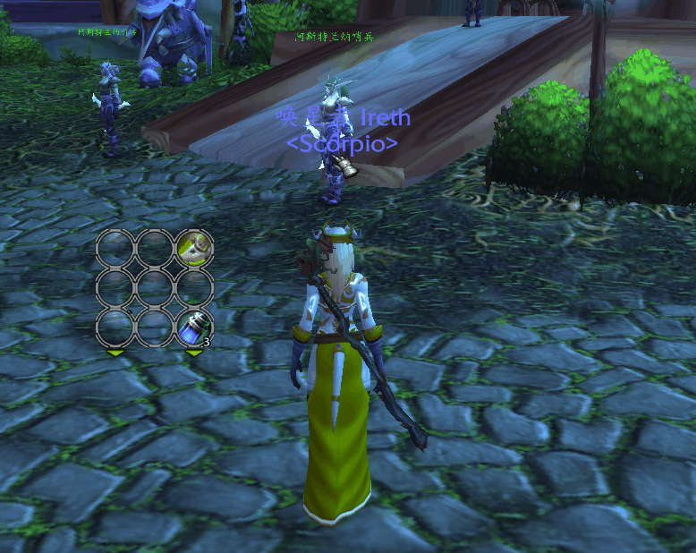

This is a flexible  and powerful action bar mod inspired by FlexBar, I always want create an unlimit flyout bar system, and now here it is.

This mod require [Scorpio](https://github.com/kurapica/Scorpio "Scorpio") Lib to work.

Commands:
=========

/shd unlock   - unlock the bars, you can move them and right click to open menu to control them.

/shd lock       - lock the bars

/shd bind       - start the key binding, you also can start key binging through the menu

/shd auto       - start bind auto gen feature to button, see later for details, also can be started through the menu

/shd custom  - start bind custom name, icon, macro text to an non-auto gen and empty button

Usages:
=======

1. You can create unlimit action bars, you can map those bar to original action bars, pet bar, stance bar.

2. You can change the aciton bar's layout based on its row count and column count.

2. You can put any flyout spell into the bar, and a flyout bar will be automatically created to show its flyout spells.

3. If you don't like the direction, use "Ctrl + Left Mouse" to drag the root action button to any direction you like.

4. Besides the flyout spell, **You can use Ctrl + Left Mouse to drag the action button, a flyout bar will be created for that action button, there is no limit count, and you also can drag the button on the flyout bar to create a the next level flyout bar, only auto gen buttons can't be drag to create the flyout bar**

5. You also can use "Ctrl + Left Mouse" to drag the last button to remove the flyout bar:

6. The flyout created will always show, you need use right button to click the root button, so the flyout will be show/hide when you move mouse into the root button. Use right button to toggle always show.

7. **You can bind short keys to the flyout buttons, it won't conflcit to the normal action bars**. The key only effect when those flyout buttons are visible, so you can call actions by sequence keys. The example use 
 **~ - 1 - 1**  sequence.  When the root button has no action, use its key will toggle its flyout bar, and if click(or with the key) any flyout button will hide the whole flyout tree, and their key bindings will be released, so it won't cause the normal action bar not effect during combat.

so with a well-deisgned layout, you can quickly switch the key-set groups like 

8. You can use **/shd auto**  or the menu to start binding auto gen rule on buttons, so a flyout bar will be generated based on the rule :

9. If you auto gen bar with items, if you find any item you don't want to display, just drag it out of the flyout bar, ShadowDancer will added it to a black list, so you won't see it again, you also can remove it from black list through the menu, the auto gen is not a powerful but simple solution.

10. You can use Masque and its skins on the addon mod.

11. You can mark an action bar to **global bar**, so it'll be shared by all the characters.

12. You can use Export/Import to share or use the layout settings :

13. You can choose** auto fade** so the bar will be hide if has no mouse focus, also you can change the **fade alpha** to a big value if you don't it be in-visible. Also you can bind macro condition to auto hide the action bar, if combine with the auto fade, the auto fade will only effect if the meet the marcro condition.

14. Since we need use empty buttons for quick key-set group switch, it's not good to just show an empty button, so you can use the menu to bind custom name & icon or just use **/shd custom** command:

You also can bind a macro text to that button, but it'll block to toggle the flyout bar, since it's not empty.

15. You can binding a swap mode to a root button with flyout bar, so the action can be swapped through the buttons.

With the mode **Swap the action to root button**

With the mode **Use the bar as the action queue**

